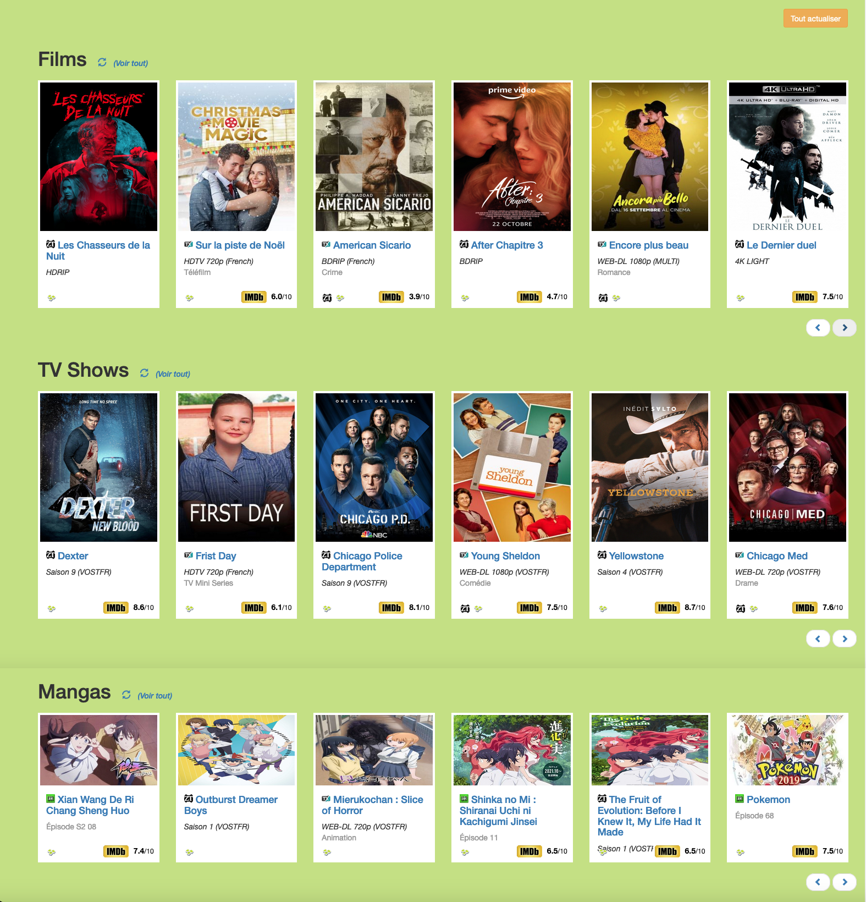

# Scrap DDL

Pour visualiser les dernières sorties de vos sites DDL préférés !

!!! Attention il est possible que votre FAI bloque les sites ci-dessous, vous pouvez utiliser un `VPN`, 
il en existe des gratuits comme `protonvpn`

Films et séries :

- https://www.zone-telechargement.fyi/
- https://www.extreme-down.gdn
- https://www.wawacity.cfd/

Mangas :

- https://www.universanime.co/
- https://www.zone-telechargement.fyi/
- https://www.extreme-down.gdn


Ces données sont triées dans l'ordre chronologique et les doublons sont évités au possible.

Les notes IMDB sont également récupérées si possible.

Un lien vers le site https://www.opensubtitles.org/fr/ est présent pour chaque films/series/mangas
et permet de DL les sous titres Français correspondant.


## Aperçu du site




## Lancer le site

Installer poetry (https://python-poetry.org/docs/#installation)

```
make install
```

Pour extreme_down il faut bypass Cloudflare's anti-bot page.
Pour cela la lib cloudscraper (https://github.com/venomous/cloudscraper) à besoin de node.js :

Your machine may already have Node installed (check with node -v). 
If not, you can install it with apt-get install nodejs on 
Ubuntu >= 18.04 and Debian >= 9 and brew install node on macOS. 
Otherwise, you can get it from Node's download page or their 
package manager installation page (https://nodejs.org/en/download/)


Puis lancer le serveur en locale :

```
make serve
```

Se rendre sur son navigateur et taper l'url suivante :
http://127.0.0.1:5000/

Ou il est possible d'utiliser le fichier `run.sh.dist` en tant qu'executable.
Pour cela il suffit de le renommer pour enlever le suffixe `.dist` et remplacer dans celui ci les `<path>`.
Puis copier le ou vous le souhaitez, donnez lui les droits d'exécution:
‘sudo chmod 755 run.sh‘
Enfin ouvrir avec le terminal.

ENJOY!


## Extra options

Un fichier settings permet d'activer ou non certaines options.

Activer ou non les sections, Films, Series ou Mangas selon vos envies avec les settings suivant :
(Toutes les sections sont activés par défaut)

```
MOVIES_SECTION_ACTIVE = True
TVSHOWS_SECTION_ACTIVE = True
MANGAS_SECTION_ACTIVE = False  # Unactive mangas section
```

Activer ou non les notes imdb (default True)

```
IMDB_RATING_ACTIVE = True
```

Définir la note minimale pour considérer un film, série ou un manga en tant que top !

```
IMDB_RATING_MINIMAL_TOP = True
```

Et plein d'autre options dans le fichier settings !
