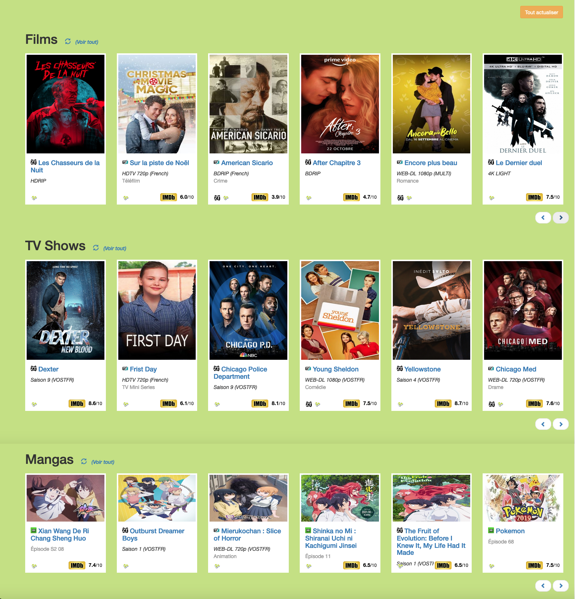

# Scrap DDL

> **⚠️ Avertissement légal**
>
> Ce projet est fourni à titre **éducatif et informatif** uniquement. Il ne fait qu'agréger
> des informations publiquement accessibles sur le web — **aucun contenu protégé n'est hébergé,
> stocké ou distribué** par ce projet.
>
> Les développeurs **ne sont en aucun cas responsables** de l'utilisation qui en est faite,
> ni du contenu hébergé par les sites tiers référencés. Le téléchargement d'œuvres protégées
> par le droit d'auteur sans autorisation est **illégal** dans de nombreux pays.
>
> **L'utilisateur est seul responsable du respect des lois en vigueur dans sa juridiction.**
>
> Ce logiciel est distribué sous [licence MIT](LICENSE) — sans aucune garantie,
> voir la licence pour les détails.

Pour visualiser les dernières sorties de vos sites DDL préférés !

Attention : il est possible que votre FAI bloque les sites ci-dessous, vous pouvez utiliser un VPN (ex: ProtonVPN).

## Providers supportés

- https://www.zone-telechargement.news/
- https://www.extreme-down.news/
- https://www.wawacity.news/
- https://www.tirexo.news/
- https://www.annuaire-telechargement.news/

Ces données sont triées dans l'ordre chronologique et les doublons sont évités au possible.

Les notes IMDB sont également récupérées si possible.

Un lien vers https://www.opensubtitles.org/fr/ est présent pour chaque film/série/manga
et permet de télécharger les sous-titres français correspondants.


## Aperçu du site




## Installation

Installer [uv](https://docs.astral.sh/uv/getting-started/installation/)

```bash
make install
```

Lancer le serveur en local :

```bash
make serve
```

Se rendre sur http://127.0.0.1:5000/


## Options

Le fichier `scrapddl/settings.py` permet de configurer l'application.

Activer ou non les sections Films, Séries ou Mangas :

```python
MOVIES_SECTION_ACTIVE = True
TVSHOWS_SECTION_ACTIVE = True
MANGAS_SECTION_ACTIVE = False  # Désactiver la section mangas
```

Configurer la clé API OMDb pour les notes IMDB :

```bash
export OMDB_API_KEY="votre_clé"
```

Obtenir une clé gratuite sur http://www.omdbapi.com/apikey.aspx

Activer ou non les notes IMDB :

```python
IMDB_RATING_ACTIVE = True
```

Définir la note minimale pour considérer un contenu en tant que "top" :

```python
IMDB_RATING_MINIMAL_TOP = 8
```

Voir le fichier settings pour toutes les options disponibles.


## Mise à jour des URLs

Les sites DDL changent régulièrement de domaine. Un script permet de détecter et mettre à jour automatiquement les URLs :

```bash
uv run check_urls.py              # Vérifier les URLs
uv run check_urls.py --update     # Mettre à jour settings.py et README.md
uv run check_urls.py --commit     # Mettre à jour et créer un commit
```

Une GitHub Action exécute ce script quotidiennement.
